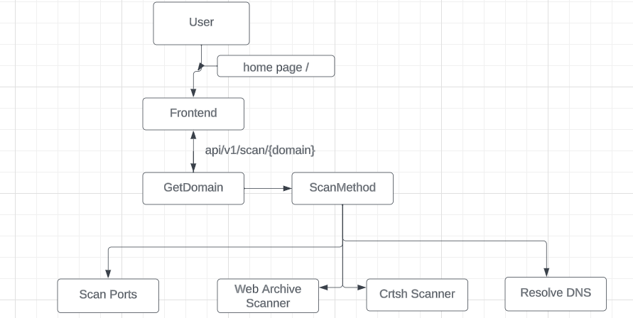

## Subdomain Enumeration Scanner


Subdomain Enumeration Scanner is a tool designed to help you discover all the subdomains associated with a specific domain.

This tool provides a way to gather valuable information that can be used for security testing, or just gaining insights into a target domain's online presence.

### Architecture



# Development Guide

This doc explains how to build and run the Subdomain Scanner source code locally using the `skaffold` command-line tool.

## Prerequisites

- [Docker for Desktop](https://www.docker.com/products/docker-desktop)
- [Minikube](https://minikube.sigs.k8s.io/docs/start/) (optional Local Cluster 1)
- [Kind](https://kind.sigs.k8s.io/) (optional Local Cluster 2)
- [kubectl](https://kubernetes.io/docs/tasks/tools/)
- [skaffold **2.0.2+**](https://skaffold.dev/docs/install/) (latest version recommended), a tool that builds and deploys Docker images in bulk.
- Clone the repository.
  ```sh
  git clone https://github.com/amosehiguese/subdomain-scanner.git
  cd subdomain-scanner/
  ```

## Run on a Local Cluster

1. Launch a local Kubernetes cluster with one of the following tools:

   - To launch **Minikube** (tested with Ubuntu Linux). Please, ensure that the
     local Kubernetes cluster has at least:

     - 4 CPUs
     - 4.0 GiB memory
     - 32 GB disk space

     ```shell
     minikube start --cpus=4 --memory 4096 --disk-size 32g
     ```

   - To launch **Docker for Desktop** (tested with Mac/Windows). Go to Preferences:

     - choose “Enable Kubernetes”,
     - set CPUs to at least 3, and Memory to at least 6.0 GiB
     - on the "Disk" tab, set at least 32 GB disk space

   - To launch a **Kind** cluster:

     ```shell
     kind create cluster
     ```

2. Run `kubectl get nodes` to verify you're connected to the respective control plane.

3. Run `skaffold run` (first time will be slow, it can take ~20 minutes).
   This will build and deploy the application. If you need to rebuild the images
   automatically as you refactor the code, run `skaffold dev` command.

4. Run `kubectl get pods` to verify the Pods are ready and running.

5. Run `kubectl port-forward pod/<Pod_name> 8080:8080` to forward a port to the frontend.

6. Navigate to `localhost:8080` to access the web frontend.

## Cleanup

If you've deployed the application with `skaffold run` command, you can run

`skaffold delete` to clean up the deployed resources.

Feel free to indulge in using this powerful tool to enhance your subdomain discovery experience.

Happy Hacking!


/*
 * This file was generated by the Gradle 'init' task.
 *
 * This generated file contains a sample Java application project to get you started.
 * For more details take a look at the 'Building Java & JVM projects' chapter in the Gradle
 * User Manual available at https://docs.gradle.org/8.0.2/userguide/building_java_projects.html
 */

plugins {
    // Apply the application plugin to add support for building a CLI application in Java.
    id 'com.google.protobuf'
    id 'idea'
    id 'application'

}

repositories {
    // Use Maven Central for resolving dependencies.
    mavenCentral()
    mavenLocal()
}

description = 'DNS Resolution Service'
group = 'dnsresolvesvc'
version = "0.1.0-SNAPSHOT"

def grpcVersion = "1.63.0"
def protocVersion = "3.25.3"

// Ensures that code is compiled with and for Java 21
tasks.withType(JavaCompile) {
    sourceCompatibility = JavaVersion.VERSION_21
    targetCompatibility = JavaVersion.VERSION_21
}

ext {
    speed = project.hasProperty('speed') ? project.getProperty('speed') : false
    offlineCompile = new File("$buildDir/output/lib")
}

dependencies {
    if (speed) {
        implementation fileTree(dir: offlineCompile, include: '*.jar')
    } else {
        implementation "com.google.api.grpc:proto-google-common-protos:2.37.1",
                "javax.annotation:javax.annotation-api:1.3.2",
                "io.grpc:grpc-protobuf:${grpcVersion}",
                "io.grpc:grpc-stub:${grpcVersion}",
                "io.grpc:grpc-netty:${grpcVersion}",
                "io.grpc:grpc-services:${grpcVersion}",
                "io.grpc:grpc-census:${grpcVersion}",
                "org.apache.logging.log4j:log4j-core:2.23.1",
                "com.google.protobuf:protobuf-java:${protocVersion}"

        runtimeOnly "com.fasterxml.jackson.core:jackson-core:${jacksonCoreVersion}",
                "com.fasterxml.jackson.core:jackson-databind:${jacksonDatabindVersion}",
                "io.netty:netty-tcnative-boringssl-static:2.0.65.Final"
    }

    // Use JUnit Jupiter for testing.
    testImplementation 'org.junit.jupiter:junit-jupiter:5.9.1'

}

protobuf {
    protoc {
        artifact = "com.google.protobuf:protoc:${protocVersion}"
    }
    plugins {
        grpc {
            artifact = "io.grpc:protoc-gen-grpc-java:${grpcVersion}"
        }
    }
    generateProtoTasks {
        all()*.plugins {
            grpc {}
        }
        ofSourceSet('main')
    }
}

sourceSets {
    main {
        java {
            srcDirs 'build/generated/source/proto/main/java/api/dnsresolve/v1'
            srcDirs 'build/generated/source/proto/main/grpc/api/dnsresolve/v1'            
        }
    }
}

// Disable default start scripts created by the
// application plugin
startScripts.enabled = false

tasks.named('test') {
    // Use JUnit Platform for unit tests.
    useJUnitPlatform()
}

// Copies all dependencies into the offlineCompile Dir
// for offline builds
task downloadRepos(type: Copy){
    from configurations.compileClasspath
    into offlineCompile
    from configurations.compileClasspath
    into offlineCompile
}

// Create start scripts
task dnsResolve(type: CreateStartScripts){
    mainClass.set('dnsresolvesvc')
    applicationName = 'DNSResolveSvc'
    outputDir = new File(project.buildDir, 'tmp')
    classpath = startScripts.classpath
}

applicationDistribution.into('bin') {
    from(dnsResolve)
    fileMode = 0755
}