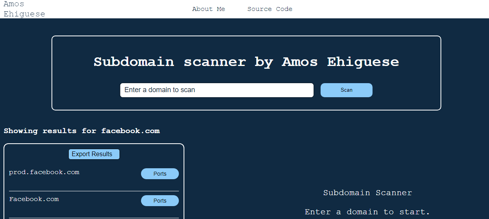

## Subdomain Enumeration Scanner

Subdomain Enumeration Scanner is a tool designed to help you discover all the subdomains associated with a specific domain.

This tool provides a way to gather valuable information that can be used for security testing, or just gaining insights into a target domain's online presence.

Feel free to indulge in using this powerful tool to enhance your subdomain discovery experience.

Happy Hacking!