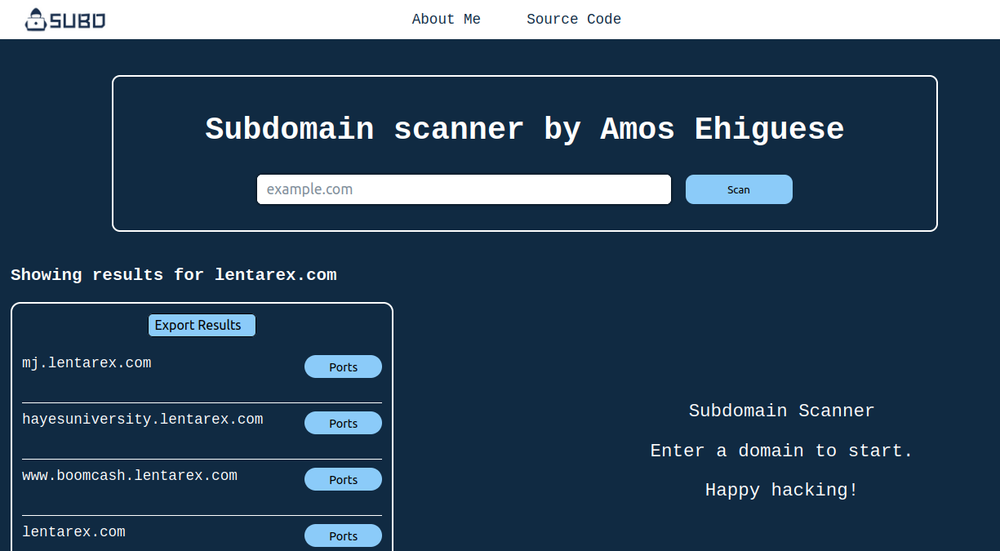

 

  Like this project ? Leave us a star ⭐

 

  <a href="#" target="_blank">
  <picture>
    <source media="(prefers-color-scheme: dark)" srcset="assets/subdomain.png">
    
  </picture>
  </a>

<h3 align="center">
  Subdomain Enumeration Tool 🔥.
</h3>

 

  
  
  

Subdomain Enumeration Scanner is a cloud-first microservices tool designed to help you discover all the subdomains associated with a specific domain.

This tool provides a way to gather valuable information that can be used for security testing, or just gaining insights into a target domain's online presence.

---

  

 

## How It Works

The user initiates a POST request containing the target domain. Upon receiving the request, the handler parses and deserializes the payload into a local data structure. This data structure is then passed to a `scan` method responsible for identifying subdomains related to the given domain.

### Steps in the `scan` Method:

1. **Subdomain Discovery:**
   - The arguments are passed to `apiQuerySvc` and `bruteSvc`, which both return lists of subdomains. These lists are combined into a single result.

2. **DNS Resolution:**
   - The combined subdomain list is passed to `resolveDnsSvc`, which resolves the subdomains into their corresponding DNS addresses.

3. **Port Scanning:**
   - The resolved DNS addresses are sent to `portScanSvc` for scanning open ports. This service returns a refined list of subdomains, each annotated with its open ports.

4. **Response Construction:**
   - The final list, including subdomains and their open ports, is sent back as a response to the client.

| Service                                              | Language      | Description                                                                                                                       |
| ---------------------------------------------------- | ------------- | --------------------------------------------------------------------------------------------------------------------------------- |
| [frontend](/src/frontend)                           | Go            | Exposes an HTTP server to serve the website.|
| [apiqueryservice](/src/apiquerysvc)                     | Typescript            | Queries external api to get associated subdomains                                                           |
| [bruteforceservice](/src/brutesvc) | Rust           | Uses the brute force methodology of finding subdomains                       |
| [dnsresolveservice](/src/dnsresolvesvc)             | Java       | Responsible for resolving domain names to its ip addresses |
| [portscanservice](/src/portscansvc)               | Rust       | Responsible for scanning subdomains for open ports                                    |
| [aiservice](/src/aisvc)             | Python           | Responsible for performing semantic understanding using embeddings generated from target domain analysis                                |

## License

Copyright 2024 Subdomain Enumeration Tool

Licensed under the Apache License.   See [LICENSE.md](LICENSE) for more information.

## Contributors ✨

## Star History

Truly grateful for your support 💖

Happy Hacking!

